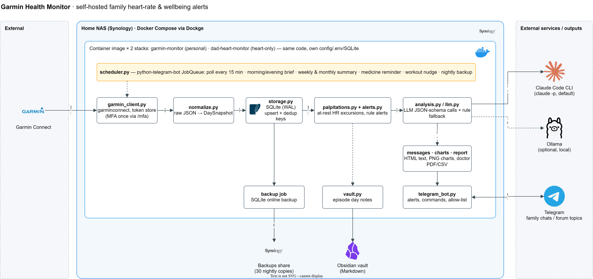

# Garmin Health Monitor

Self-hosted service that turns a family's Garmin watch data into timely Telegram alerts: at-rest heart-rate episodes, "watch not synced" and low-HR safety checks, medicine reminders, daily coaching and a monthly doctor report (PDF + CSV).




> Note: despite the repository name, this is **not** the upstream `python-garminconnect` library. It is an application (package `garmin_health_monitor`) that *uses* that library.

## Why this exists

An older family member wears a Garmin watch and reports occasional heart palpitations. Garmin records the heart rate but nobody looks at it in time, and a doctor wants dated episodes, not "it happens sometimes". This service polls Garmin every 15 minutes, flags heart-rate excursions *at rest* (not exercise), pushes an alert with a zoomed chart to the family chat, and keeps a diary the doctor can read. It runs on a home NAS, so the raw data stays at home.

## Highlights

- **Signal, not noise.** The detector (`garmin_health_monitor/palpitations.py`) uses a causal rolling at-rest baseline, a step-count gate (walking is not a palpitation), sleep windows and a transparent confidence score instead of a fixed "HR > 100" rule. Thresholds are per-profile config because one person's resting HR is another's alarm.
- **Idempotent alerts.** Episodes get a stable fingerprint and overlapping windows are merged (`storage.upsert_episode`) so an ongoing episode updates in place instead of paging every 15 minutes; rule alerts are deduped by key in a `notifications` table (`alerts.py`, `scheduler.notify_alert`).
- **Outage-aware.** A Garmin blip does not page anyone: failures are silent for 2 h, then one plain-language alert (login vs. servers down), then an all-clear, and on recovery the earlier days the outage covered are re-checked so nothing is missed (`scheduler._poll_failed` / `_poll_ok`).
- **LLM as an optional layer, never a dependency.** Coaching and episode assessments call the Claude Code CLI in print mode with a JSON schema (`claude_cli_client.py`), or a local Ollama (`ollama_client.py`), behind one `LLMClient` protocol (`llm.py`). Every call is wrapped in `except LLMError` with a rule-based fallback, so alerts still go out if the model is down. The CLI runs with tools disabled (`--tools "" --permission-mode dontAsk`) and `--safe-mode`.
- **Safety wording is code, not prompt.** A hard-coded red-flag check (`analysis.has_red_flag`) adds an emergency-number banner whenever a logged symptom mentions chest pain, fainting or breathlessness, regardless of what the model says. Messages state they are not a diagnosis.
- **Data durability without a DB server.** SQLite in WAL mode, and a nightly SQLite *online* backup (`Storage.backup_to`) that is consistent while the app writes, rotated to the newest 30 copies on a NAS share.
- **Least exposure.** Every Telegram handler checks a chat allow-list (`AppConfig.is_authorised`) and ignores strangers; dynamic values are HTML-escaped (`messages.esc`); secrets come only from `${ENV}` interpolation in config and a git-ignored `.env`; the container runs as a non-root user.

## How it works

1. **Fetch** — `scheduler.py` (python-telegram-bot JobQueue) polls each profile every 15 min; `garmin_client.py` uses `garminconnect` with a persistent token store (MFA once, via `/mfa` in Telegram).
2. **Normalise** — `normalize.py` maps raw payloads to a `DaySnapshot` (HR, steps, stress, sleep, HRV, Body Battery, SpO2, activities).
3. **Store** — `storage.py` writes snapshots, intraday HR and raw JSON to SQLite.
4. **Detect** — `palpitations.py` finds at-rest excursions; `alerts.py` evaluates rule alerts (resting HR vs. 7-day average, low SpO2, no sync, low HR).
5. **Assess** — `analysis.py` asks the LLM for a plain-language view of each new episode and for daily/weekly coaching.
6. **Render** — `messages.py`, `charts.py` (matplotlib) and `report.py` build Telegram HTML, PNG charts and the doctor PDF/CSV.
7. **Send** — `telegram_bot.py` delivers alerts (with "I felt it / didn't notice" buttons), holds non-critical ones during quiet hours, and answers commands.
8. **Keep** — nightly DB backup to a NAS share; `vault.py` writes episode day notes into an Obsidian vault.

Two NAS stacks run the same image with different config: `garmin-monitor` (personal fitness: briefs, weekly review, workout nudge) and `dad-heart-monitor` (heart-only: episode alerts, nightly heart review, medicine reminder, safety alerts).

## Tech stack

| Layer | Tech |
|---|---|
| Language | Python 3.12 |
| Data source | Garmin Connect via [`garminconnect`](https://pypi.org/project/garminconnect/) |
| Bot + scheduling | `python-telegram-bot[job-queue]` 22 |
| Storage | SQLite (WAL) + online backup |
| LLM | Claude Code CLI (`claude -p`, JSON schema) or Ollama; rule-based fallback |
| Charts / reports | matplotlib (PNG, multi-page PDF) + CSV |
| Runtime | Docker Compose on a Synology NAS (Dockge) |
| Quality | pytest + pytest-asyncio, ruff |

## Getting started

Prereqs: Docker (or Python 3.12), a Telegram bot token from @BotFather, a Garmin Connect account.

```bash
cp config.example.yaml config/config.yaml   # edit profiles, thresholds, schedule
cat > .env <<'EOF'
TELEGRAM_BOT_TOKEN=
TELEGRAM_ADMIN_CHAT_ID=
MY_GARMIN_EMAIL=
MY_GARMIN_PASSWORD=
CLAUDE_CODE_OAUTH_TOKEN=     # from `claude setup-token`; omit if llm.backend is ollama/none
EOF
docker compose up -d --build
```

The shipped `docker-compose.yaml` targets the NAS (`env_file: .env`, bind mounts for `./config`, `./data` and a backups share); adjust the backup path for your host. Config values support `${VAR}` and `${VAR:-default}`.

Local CLI (`pip install -e ".[dev]"`, then `garmin-monitor <cmd>`):

| Command | Purpose |
|---|---|
| `login` | Interactive Garmin login (MFA) to seed the token store |
| `run` | Bot + scheduler (the container's default) |
| `poll` / `backfill` / `detect` | One-off fetch, history backfill, run the detector for a day |
| `brief` / `analyze` / `report` | Print or send a brief, coaching, or the doctor report |
| `test-telegram` / `test-llm` | Connectivity checks |

Telegram commands: `/today /yesterday /sleep /hr /steps /episodes /palp /note /report /analyze /status /profiles /mfa /help`.

## Project structure

```
garmin_health_monitor/
  cli.py, scheduler.py, telegram_bot.py   # entrypoints, jobs, bot
  garmin_client.py, normalize.py          # fetch + normalise
  storage.py                              # SQLite, dedup, backup
  palpitations.py, alerts.py              # detection + rule alerts
  analysis.py, llm.py, claude_cli_client.py, ollama_client.py
  messages.py, charts.py, report.py, vault.py
tests/                                    # 244 tests
docs/ARCHITECTURE.md, docs/MESSAGES.md    # module contracts, message catalogue
docs/vault/                               # Obsidian notes: overview, changelog, roadmap
```

## Testing & quality

```bash
pip install -e ".[dev]"
pytest          # 244 passed
ruff check .    # All checks passed
```

Tests cover the detector, alert rules, message rendering, charts, the doctor report, the Claude CLI and Ollama clients (subprocess/HTTP stubbed), the service layer and the Telegram handlers. There is no CI workflow yet; the suite is run locally before deploying.

## Design decisions & limitations

- **Not a medical device.** Garmin samples intraday HR about every 2 minutes; short arrhythmias are invisible and thresholds are heuristics. Low-HR and medicine-reminder settings are placeholders to be confirmed with a doctor.
- **Cloud LLM trade-off.** With the Claude backend, health notes leave the NAS; Ollama keeps everything local at the cost of weaker summaries. `llm.backend: none` disables it.
- **Unofficial API.** `garminconnect` uses Garmin's web endpoints, which can change or rate-limit without notice.
- **Single process, SQLite.** Right-sized for a household; not built for many users.
- **Deploy by bind-mount.** Code is mounted over the image so updates are "copy files + restart"; convenient on a NAS, but it bypasses image versioning.
- Roadmap: follow-up message after a red-flag log, CI pipeline, threshold review after two weeks of data (see `docs/vault/Roadmap.md`).

---

James Koh · [GitHub](https://github.com/gcjk768)
